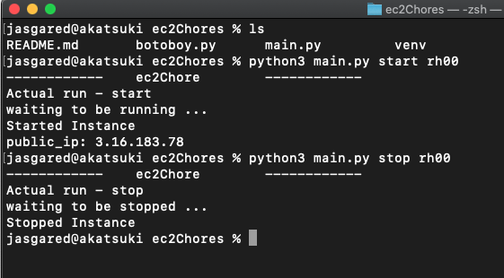

# ec2Chores
This repo contains scripts/ helpers to perform ec2 chores.

# Requirements

Install / Configure boto3 module as specified here in [aws docs](https://boto3.amazonaws.com/v1/documentation/api/latest/guide/quickstart.html).

# Execution

Runnning the script.

Specify the state and instance name running the python script.

Eg:
```
python main.py start instance_name

python main.py stop instance_name
```

<br/>

